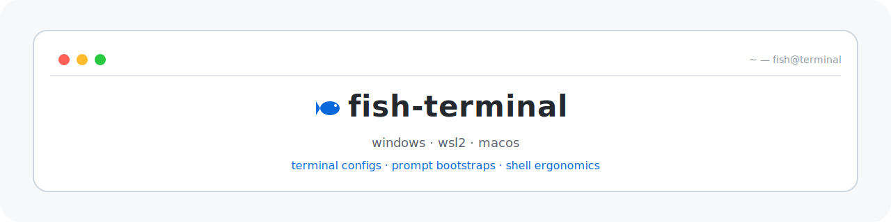

<p align="center">
  
</p>

<p align="center">
  <code>terminal configs · prompt bootstraps · shell ergonomics</code>
</p>

<p align="center">
  English | <a href="./README.md">简体中文</a>
</p>

A sanitized snapshot of my terminal setup for sharing.

It focuses on:

- Windows Terminal profiles, keybindings, fonts, and color schemes
- PowerShell prompt bootstrap and profile functions
- cmd with clink injection, readline, and console defaults
- WSL2 host settings and Ubuntu fish configuration
- macOS Ghostty appearance and spacing settings

## Layout

```text
.
|-- macos
|   |-- README.md
|   `-- ghostty
|       `-- config
|-- windows
|   |-- cmd
|   |   |-- .inputrc
|   |   |-- clink_settings
|   |   |-- command-processor.reg
|   |   `-- console-settings.md
|   |-- git-bash
|   |   |-- .bash_profile
|   |   |-- .bashrc
|   |-- README.md
|   |-- pwsh
|   |   `-- Microsoft.PowerShell_profile.ps1
|   `-- terminal
|       `-- settings.json
|-- wsl2
|   |-- README.md
|   |-- .wslconfig
|   `-- ubuntu
|       |-- etc
|       |   `-- wsl.conf
|       `-- fish
|           |-- config.fish
|           |-- conf.d
|           |   |-- 99-oh-my-posh.fish
|           |   `-- rustup.fish
|           `-- fish_plugins
`-- docs
    `-- placeholders.md
```

## Notes

- Usernames, private absolute paths, custom asset locations, proxy endpoints, and secrets have been replaced with placeholders.
- Git Bash is intentionally lightweight here. The main interactive setups are PowerShell on Windows and fish inside WSL2.
- The macOS terminal example in this repo targets Ghostty.
- Dynamic state files such as `fish_variables`, histories, logs, and generated plugin internals are not committed.
